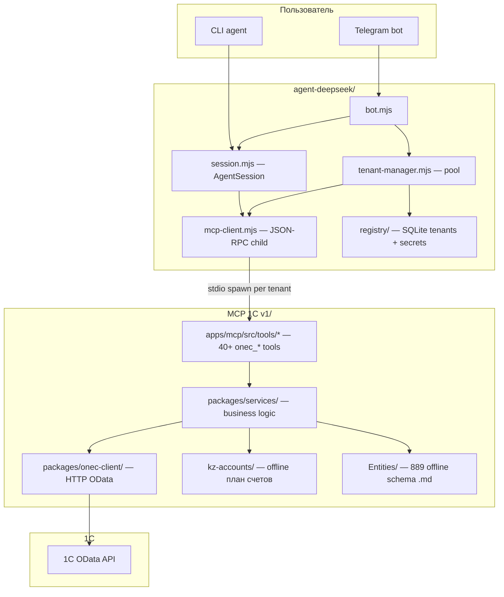

# Zoom-out: onec-kz system map

Multi-tenant financial AI over **1C:Бухгалтерия (KZ)**. A user asks in natural language (Telegram or CLI); **DeepSeek** picks MCP tools; tools read/write **Организация** data via OData and return **ОСВ**, **проводки**, **сальдо**, validation findings, and reports.

---

## The three layers



**Call chain for one user message:**

`bot.mjs` → `tenant-manager.getClient(tenantId)` → `AgentSession.runTurn()` → `McpClient.callTool()` → MCP tool handler → Service → `OneCClient` → 1C OData

---

## Module map (who calls whom)

| Layer | Module | Role | Called by |
|-------|--------|------|-----------|
| **Entry** | `bot.mjs` | Telegram, `/register` wizard, tenant routing | Telegram |
| **Entry** | `agent.mjs` | Interactive CLI | Terminal |
| **Orchestration** | `session.mjs` | LLM loop (max 20 steps), parallel tool calls, skills | `bot.mjs`, `agent.mjs` |
| **Process pool** | `tenant-manager.mjs` | One MCP child per **Организация** tenant; LRU, quarantine, backoff | `bot.mjs` |
| **MCP bridge** | `mcp-client.mjs` | Spawns `dist/server.bundle.js`, tool denylist, 120s timeout | `session.mjs`, registration wizard |
| **Persistence** | `registry/` | Tenants, encrypted 1C credentials, usage history | `bot.mjs`, `onboard.mjs` |
| **MCP bootstrap** | `server.ts` | DI: wires all services + registers tools | `index.ts` (stdio) |
| **Org guard** | `org-context.ts` + `tools/utils.ts` | Resolves **Организация** GUID at startup; corrects hallucinated GUIDs in every response `_meta` | All tool handlers |
| **Tools** | `tools/*.tools.ts` (28 files) | Thin MCP adapters: Zod args → service call → JSON | MCP protocol |
| **Domain** | `packages/services/` (~25 classes) | **Проводки**, **ОСВ**, validation, drill-down, reports | Tool modules |
| **Transport** | `onec-client/` | OData HTTP: registers, catalogs, documents | All services |
| **Reference** | `kz-accounts/` | Offline KZ chart (no 1C call) | `accounts.tools.ts` |
| **Schema** | `Entities/` + `EntitySchemaService` | 889 entity definitions offline | `guid-resolver`, `entity-schema` tools |
| **Rendering** | `render/bridge.mjs` | Python sidecar for segments/xlsx/pdf | Bot (optional) |

---

## Domain capability groups (glossary-aligned)

Tools are grouped by accounting concern, not by file layout.

### 1. Справочники и документы

- **Контрагент**, **Номенклатура**, **Склад**, **Организация** — `catalog.tools.ts` → `CatalogService`
- **Регистратор** (source documents) — `document.tools.ts` → `DocumentService`
- GUID → entity name — `guid-resolver.tools.ts` → `GuidResolverService`

### 2. Регистры и сальдо

- **Сальдо**, **оборот**, **субконто** — `register.tools.ts` → `RegisterService`
- Universal account view (by corr. счёт, subconto, risks) — `account-analysis.tools.ts` → `AccountAnalysisService`

### 3. Отчёты (ОСВ and beyond)

- **ОСВ** (trial balance) — `reports.tools.ts` → `ReportsService`
- Debtors/creditors (1210, 3310…), sales, purchases, cash flow, payroll docs — same
- Full P&L + balance sheet — `fullreport.tools.ts`

### 4. Налоги и закрытие периода

- **НДС**, **КПН**, **ИПН**, **ОПВ**, **СО**, **ЭСФ** — `validation-tax.tools.ts`, `production.tools.ts`
- Period close, **НЗП** (8110/8112), depreciation — `validation-period-close.tools.ts`, `costing.tools.ts`
- After a flag: drill into **проводки** — `validation-drilldown.tools.ts` → `DrillDownService`

### 5. Аудит и целостность

- Double-entry, account signs, **красное сторно** patterns — `validation-integrity.tools.ts` → `IntegrityValidator`
- Quality audit per period — `auditor.tools.ts` → `AuditorService`
- Anomaly scan — `anomaly-ml.tools.ts` → `AnomalyMLService`

### 6. Offline reference (no 1C)

- KZ **план счетов** lookup — `accounts.tools.ts` → `AccountsService`
- Entity schema from `Entities/` — `entity-schema.tools.ts` → `EntitySchemaService`

---

## Data flow for a typical question

**Example:** *"Какое сальдо по 1210 у контрагента X за март?"*

```
User message
  → AgentSession (DeepSeek picks tools)
  → onec_search_contractors        → Catalog_Контрагенты
  → onec_get_contractor_balance    → AccountingRegister + ExtDimension
  → (optional) onec_analyze_account → bySubconto view, risks[]
  → Response with _meta.orgGuid (corrected if needed)
```

**Example:** *"Проверь готовность к закрытию месяца"*

```
onec_validate_period_close_readiness
  → unposted docs, depreciation, ЗакрытиеМесяца
  → if issues: onec_drill_unposted_documents / onec_drill_wip_documents
```

---

## Cross-cutting concerns

| Concern | Where |
|---------|-------|
| **Multi-tenancy** | SQLite registry; each tenant = separate MCP child with own `ONEC_*` env |
| **Org GUID safety** | `buildOrgContext()` at MCP startup; `resolveOrg()` in every tool |
| **Tool surface control** | Denylist in `mcp-client.mjs` (e.g. legacy `onec_get_accounting_turnovers`) |
| **Secrets** | AES-256-GCM in `registry/crypto.mjs`; MCP child gets allowlisted env only |
| **LLM behavior** | System prompt in `guide/11-deepseek-system-prompt.md`; skills in `guide/skills/` |

---

## Repo roots (mental model)

```
MCP metadata/
├── agent-deepseek/     ← "who talks to the user" (Telegram, CLI, tenant pool)
├── MCP 1C v1/          ← "what knows 1C accounting" (MCP server + services)
├── guide/              ← prompts and agent skills
├── docs/ + Entities/   ← offline metadata (план счетов, OData schema)
└── CODEBASE.md         ← full file-level reference
```

---

## Where to zoom in next

| If you care about… | Start here |
|--------------------|------------|
| Telegram + registration | `agent-deepseek/bot.mjs` |
| LLM tool loop | `agent-deepseek/session.mjs` |
| Tool wiring / DI | `MCP 1C v1/apps/mcp/src/server.ts` |
| Account analysis / проводки | `AccountAnalysisService.ts`, `account-analysis.tools.ts` |
| Validation + drill-down | `validation-*.tools.ts`, `DrillDownService.ts` |
| OData quirks | `packages/onec-client/`, `RegisterService.ts` |

---

*Generated from /zoom-out — 2026-06-15. See also `CODEBASE.md` for file-level detail and section 16 for the full domain glossary.*
